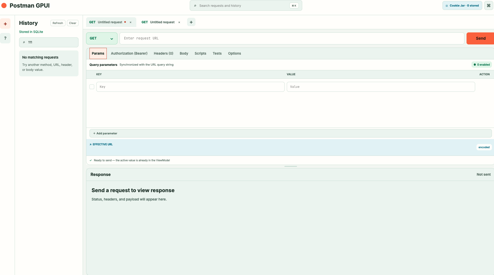

# Postman GPUI

Postman GPUI 是一个使用 Rust 和 GPUI 构建的原生跨平台 HTTP 客户端，重点提供快速的
请求/响应操作、完善的键盘编辑体验以及本地优先的请求历史。

[English](README.md)



## 功能

- 支持 GET、POST、PUT、PATCH、DELETE、HEAD 和 OPTIONS
- 支持查询参数、自定义请求头、Basic/Bearer 认证和 Cookie
- 支持 JSON、Raw、URL-encoded、Multipart 请求体及文件上传
- 支持重定向策略、响应解压、超时和取消
- 展示响应状态、响应头和格式化响应体，并支持快速复制
- 支持多标签页、全局搜索和可回放的 SQLite 历史记录
- 支持跨平台键盘操作、文本选择和剪贴板行为

## 安装

从 [GitHub Releases](https://github.com/847850277/postman-gpui/releases) 下载对应平台的安装包：

| 平台 | 首版安装包 | 支持范围 |
| --- | --- | --- |
| macOS | 通用架构 `.dmg` 或打包后的 `.app` | Intel 与 Apple 芯片，macOS 10.15.7+ |
| Windows | NSIS `.exe` 安装程序 | Windows 10+，x86_64 |
| Linux | `.AppImage` 或 `.deb` | x86_64，支持 Vulkan 的 Wayland/X11 桌面 |

各平台依赖、预发布未签名提示和 Linux 运行库见[安装指南](docs/installation.md)。

## 从源码运行

仓库通过 `rust-toolchain.toml` 固定 Rust 版本：

```bash
git clone https://github.com/847850277/postman-gpui.git
cd postman-gpui
cargo run --locked
```

Linux 需要先安装[安装指南](docs/installation.md#linux)列出的 GPUI 开发依赖。

在本机生成对应平台的安装包：

```bash
cargo install cargo-packager --version 0.11.8 --locked
python3 scripts/release.py package
```

在 macOS 上生成 Intel 与 Apple 芯片通用安装包：

```bash
python3 scripts/release.py package --universal-macos
```

## 验证

```bash
cargo fmt -- --check
cargo clippy --locked --all-targets --all-features -- -D warnings
cargo test --locked --all-targets --all-features
cargo httpbingo-scenarios
python3 -m unittest discover -s scripts/tests
```

## 首版范围

v0.1.0 功能范围由 [#50](https://github.com/847850277/postman-gpui/issues/50) 跟踪。
二进制下载、响应保存和流式进度暂时保留在
[#69](https://github.com/847850277/postman-gpui/issues/69)；等未来 CLI、性能测试可复用的 HTTP
核心架构明确后再继续实现，它们不阻塞首版发布。

发布相关资料：

- [CHANGELOG](CHANGELOG.md)
- [输入实时同步验收映射](docs/autofill-contract.md)
- [发布操作手册](docs/releasing.md)
- [跨平台冒烟测试清单](docs/release-smoke-test.md)

## 本地数据与隐私

已完成请求的历史记录保存在操作系统本地应用数据目录下的
`postman-gpui/request-history.sqlite3`。已知凭据和 Cookie 在持久化前会被移除；取消请求和传输失败
不会写入历史。

## 许可证

[MIT](LICENSE)
