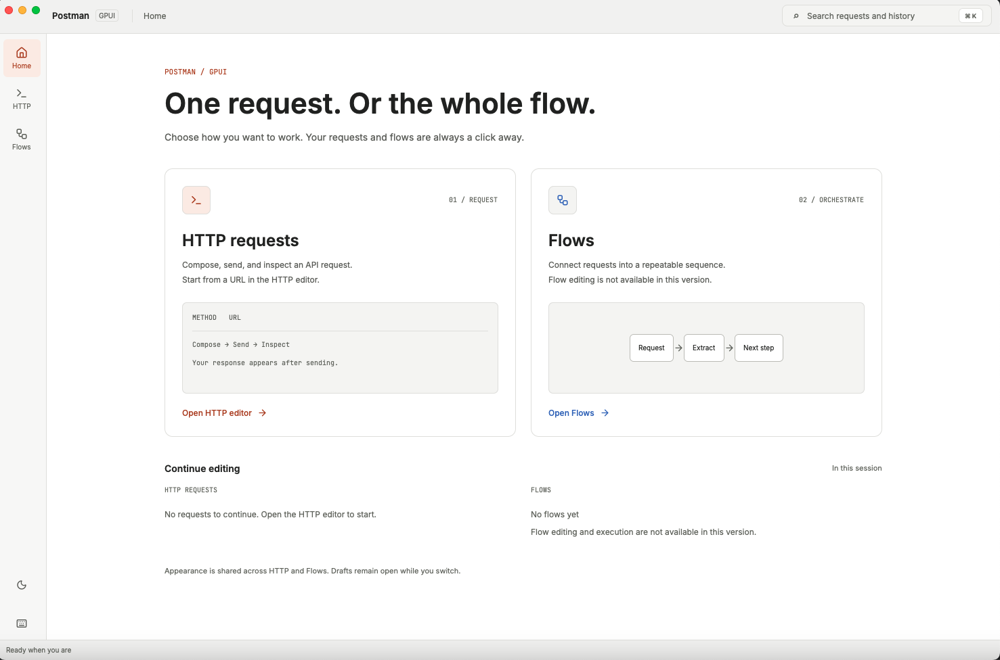

# Postman GPUI

Postman GPUI 使用 Rust 和 GPUI 构建原生跨平台 HTTP 客户端，并提供用于编排可重复执行的
HTTP 流程的 Flow DSL。桌面应用用于交互式请求调试，`postman-g` 用于在命令行检查和执行请求文件与流程。

[English](README.md)



## 项目组成

| 组件 | 当前能力 | 入口 |
| --- | --- | --- |
| 原生桌面应用 | HTTP 请求编辑、响应查看、多标签页和本地历史 | `cargo run --locked` |
| Flow DSL 与 CLI | 编译、执行 `.http` 请求和 `.http.yml` 流程 | [postman-g](crates/postman-cli/README.md) |
| Flow MCP Server | 为 Agent 提供 Schema、示例、校验、结构检查和 YAML 生成 | [postman-flow-mcp](crates/postman-flow-mcp/README.md) |
| HTML UI 原型 | 独立的 Home、HTTP 和 Flows 界面，使用模拟响应 | [预览说明](prototypes/README.md) |

新的 HTTP/Flows 导航和可视化流程编辑器目前处于 HTML 原型阶段。原生桌面应用尚未接入 Flow
编辑器；实际流程执行通过 CLI 或 Rust API 完成。

## 桌面 HTTP 功能

- 支持 GET、POST、PUT、PATCH、DELETE、HEAD 和 OPTIONS
- 支持查询参数、自定义请求头、Basic/Bearer 认证和 Cookie
- 支持 JSON、Raw、URL-encoded、Multipart 请求体及文件上传
- 支持重定向策略、响应解压、超时和取消
- 展示响应状态、响应头和格式化响应体，并支持快速复制
- 支持多标签页、全局搜索和可回放的 SQLite 历史记录
- 支持跨平台键盘操作、文本选择和剪贴板行为

## 安装

从 [GitHub Releases](https://github.com/847850277/postman-gpui/releases) 下载对应平台的安装包：

| 平台 | 桌面安装包 | 支持范围 |
| --- | --- | --- |
| macOS | 通用架构 `.dmg` 或打包后的 `.app` | Intel 与 Apple 芯片，macOS 10.15.7+ |
| Windows | NSIS `.exe` 安装程序 | Windows 10+，x86_64 |
| Linux | `.AppImage` 或 `.deb` | x86_64，支持 Vulkan 的 Wayland/X11 桌面 |

Release 同时提供 macOS、Windows 和 Linux 的独立 `postman-g` CLI 压缩包。
CLI 安装方式、各平台依赖、预发布未签名提示和 Linux 运行库见[安装指南](docs/installation.md)。
下载后使用对应 Release 的 `SHA256SUMS` 校验文件。

## 从源码运行

仓库通过 `rust-toolchain.toml` 固定 Rust 版本：

```bash
git clone https://github.com/847850277/postman-gpui.git
cd postman-gpui
cargo run --locked
```

Linux 需要先安装[安装指南](docs/installation.md#linux)列出的 GPUI 开发依赖。

GPUI Kit 迁移直接在 `cargo run --locked` 打开的真实应用中逐步进行，
从 Home 进入 HTTP 即可查看请求编辑区。Body 支持 None、JSON、Raw、URL encoded、
Form-data 和 Binary，切换类型保留各自草稿。请求表格、Body 编辑器和响应面板
使用 Kit 滚动条，支持滚轮、拖动滑块和点击轨道。搜索、认证、Options、描述和表格
单元格使用 Kit Input 管理输入法、选区、撤销及原生编辑菜单；Body 和响应文本
保留专用渲染，并使用 Kit 右键菜单。使用
`cargo test --locked --test ui_shell --test ui_kit --test ui_layout`
验证页面导航、原生控件交互和布局。

在本机生成对应平台的安装包：

```bash
cargo install cargo-packager --version 0.11.8 --locked
python3 scripts/release.py package
```

在 macOS 上生成 Intel 与 Apple 芯片通用安装包：

```bash
python3 scripts/release.py package --universal-macos
```

## Flow DSL 与 CLI

无界面 Runner 将 `.http` 文件和原生 `.http.yml` 流程编译为统一的 `postman-flow` 计划，通过共享的
`postman-http` / `postman-request` 传输层执行。未被错误策略处理的传输、断言或循环失败会返回非零退出码。

Flow v1 支持顺序 HTTP 步骤、带类型的输入输出、JSONPath 提取、断言、条件步骤、有界
`for_each` / `repeat_until` 循环及可复用 API 定义。报告保留 JSON 类型，并对标记为敏感的输出脱敏。

在仓库根目录使用内置 API 目录示例：

```bash
# 仅解析和编译，不发送请求
cargo run --locked -p postman-cli -- run \
  crates/postman-flow/examples/flows/httpbingo_catalog.http.yml --check

# 向 HTTPBingo 发送请求，并输出 JSON 报告
cargo run --locked -p postman-cli -- run \
  crates/postman-flow/examples/flows/httpbingo_catalog.http.yml \
  --input client=hello --json
```

安装独立二进制后可直接使用 `postman-g run <文件或目录>`。`--input` 和 `--var` 是别名。
目录会递归发现请求文件并按路径排序执行；同一次运行中的文件共享 Cookie 会话。

详细语法见 [CLI 说明](crates/postman-cli/README.md)、[Flow v1 规范](crates/postman-flow/README.md)、
[JSON Schema](crates/postman-flow/flow-v1.schema.json) 和[流程示例](crates/postman-flow/examples/flows)。

## 供 Agent 生成 Flow 的 MCP Server

`postman-flow-mcp` 通过 MCP stdio 暴露 Flow v1 Schema、完整参考、已验证示例、编译诊断、结构检查和
规范化 YAML 创建能力。Agent 提交结构化 JSON 文档，服务端编译通过后才写入文件，并将全部文件访问
限制在配置的工作目录中；该服务不会执行网络请求。

```bash
cargo run --locked -p postman-flow-mcp -- --root /absolute/path/to/flow-project
```

六个 MCP 工具和客户端配置见 [MCP Server 说明](crates/postman-flow-mcp/README.md)。

## HTML UI 原型

在仓库根目录启动预览服务，无需安装前端依赖或构建：

```bash
python3 -m http.server 4173 --bind 127.0.0.1
```

打开[原型页面](http://127.0.0.1:4173/prototypes/request-workspace.html#home)。首页区分 HTTP 请求和
Flows 两个入口，布局自适应窗口大小，默认白色主题，可手动切换暗色。HTTP 界面支持 cURL 导入导出和
环境设置；Flow 界面支持步骤编辑、检查、运行预览和 `.http.yml` 导出。

Send 和 Run preview 使用本地模拟数据，Flow 检查仅包含浏览器端的部分规则，编辑数据只保留在当前页面
会话中。原型尚未连接 Rust 运行时，也不替代原生客户端 E2E 测试。交互方式、支持语法和限制见
[原型说明](prototypes/README.md)。

## 验证

```bash
cargo fmt -- --check
cargo clippy --locked --workspace --all-targets --all-features -- -D warnings
cargo test --locked --workspace --all-targets --all-features
python3 -m unittest discover -s scripts/tests
```

公共 HTTPBingo 场景需要联网，单独运行：

```bash
cargo httpbingo-scenarios
```

HTML 解析器和模型测试需要 Node.js 18 或更新版本：

```bash
node --test prototypes/curl-request.test.cjs prototypes/flow-model.test.cjs
```

桌面请求场景见[测试说明](tests/cases/README.md)。Vaultwarden、Meilisearch、Qdrant 的依赖准备和
专项测试入口见 [Flow E2E 说明](crates/postman-flow-e2e/README.md)。这些测试需要按文档配置对应服务，
不能仅凭一次普通 workspace 测试通过就认定服务集成场景已执行。

## 当前限制

- 响应体仍使用缓冲后的文本模型，尚未提供原始字节响应查看、响应原子保存和流式响应的增量进度。
- 上述可视化 Flow 编辑器、cURL 导入导出和新版 HTTP 界面属于原型能力；实际 Flow 执行请使用 CLI。

## 文档

- [CHANGELOG](CHANGELOG.md) 与[开放问题](https://github.com/847850277/postman-gpui/issues)
- [输入实时同步验收映射](docs/autofill-contract.md)
- [发布操作手册](docs/releasing.md)
- [跨平台冒烟测试清单](docs/release-smoke-test.md)

## 本地数据与隐私

已完成请求的历史记录保存在操作系统本地应用数据目录下的
`postman-gpui/request-history.sqlite3`。已知凭据和 Cookie 在持久化前会被移除；取消请求和传输失败
不会写入历史。

## 许可证

[MIT](LICENSE)
