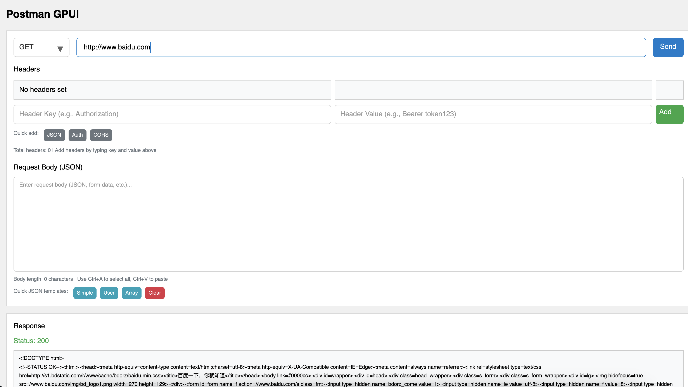

# Postman GPUI

Postman GPUI 是一个受 Postman 启发的简单图形用户界面应用程序，用于发送 HTTP 请求。该应用程序允许用户以用户友好的方式创建、管理和发送 HTTP 请求并查看响应。

## 功能特性

- 输入请求详细信息，包括 URL、HTTP 方法、请求头和请求体
- 查看服务器响应，包括状态码和响应体
- 将请求组织到集合中以便于管理
- 可重用的 UI 组件，提供一致的用户体验
- 完整的键盘快捷键支持
- 专业的 JSON 编辑器，支持多行编辑和语法高亮
- 现代化的用户界面，基于 GPUI 框架构建

## 项目结构

```text
postman-gpui
├── src
│   ├── main.rs          # 应用程序入口点
│   ├── lib.rs           # 库接口
│   ├── app              # 应用程序逻辑
│   │   ├── mod.rs
│   │   └── postman_app.rs
│   ├── ui               # 用户界面组件
│   │   ├── mod.rs
│   │   └── components
│   │       ├── mod.rs
│   │       ├── method_selector.rs  # HTTP 方法下拉选择器
│   │       ├── url_input.rs        # URL 输入框，带验证功能
│   │       ├── header_input.rs     # 请求头键值对输入组件
│   │       ├── body_input.rs       # 请求体编辑器，支持 JSON
│   │       ├── body_editor.rs      # 请求体编辑器容器
│   │       └── dropdown.rs         # 可重用下拉组件
│   ├── http             # HTTP 功能
│   │   ├── mod.rs
│   │   ├── client.rs    # HTTP 客户端实现
│   │   ├── request.rs   # HTTP 请求模型
│   │   └── response.rs  # HTTP 响应模型
│   ├── models           # 数据模型
│   │   ├── mod.rs
│   │   ├── collection.rs # 请求集合管理
│   │   └── workspace.rs  # 工作空间数据结构
│   ├── assets           # 应用程序资源
│   │   └── mod.rs
│   └── utils            # 工具函数
│       ├── mod.rs
│       └── helpers.rs   # 辅助工具
├── examples             # 示例用法和演示
│   ├── advanced_dropdown_example.rs
│   ├── basic_request.rs
│   ├── deferred_anchored_example.rs
│   └── text_input_demo.rs
├── assets               # 静态资源
│   └── fonts           # 字体文件
├── postman-gpui/       # 附加示例
│   └── examples/
│       └── basic_request.rs
├── Cargo.toml          # Cargo 配置文件
├── Cargo.lock          # Cargo 锁定文件
├── README.md           # 项目文档（英文）
├── README-zh.md        # 项目文档（中文）
├── todo.md             # 开发待办事项
└── test_server.py      # 开发用测试 HTTP 服务器
```

## 开始使用

1. 克隆仓库：

   ```bash
   git clone https://github.com/yourusername/postman-gpui.git
   cd postman-gpui
   ```

2. 构建项目：

   ```bash
   cargo build
   ```

3. 运行应用程序：

   ```bash
   cargo run
   ```

## 使用方法

- 打开应用程序，在 URL 输入框中输入所需的 URL
- 使用方法选择器选择 HTTP 方法（GET、POST 等）
- 使用请求头编辑器添加任何必要的请求头
- 如果需要，输入请求体（支持 JSON 格式）
- 点击"发送"按钮发送请求，并在响应面板中查看响应

## 应用程序菜单

- **菜单按钮**: 点击右上角的 "☰ Menu" 按钮
  - **Exit（退出）**: 关闭应用程序

## 键盘快捷键

- **退出应用程序**: 
  - macOS: `Cmd+Q`
  - Windows/Linux: `Ctrl+Q`

## 截图



## 主要组件功能

### URL 输入框 (UrlInput)

- 支持完整的键盘导航和编辑
- URL 验证和自动补全
- 历史记录支持

### 方法选择器 (MethodSelector)

- 支持所有标准 HTTP 方法
- 现代化下拉界面
- 键盘快捷键支持

### 请求头编辑器 (HeaderInput)

- 键值对输入支持
- 自动补全常用请求头
- 完整的文本编辑功能

### 请求体编辑器 (BodyInput)

- 多行文本编辑
- JSON 格式支持
- 语法高亮（等宽字体）
- 完整的键盘快捷键：
  - `Cmd+A`: 全选
  - `Cmd+C/V/X`: 复制/粘贴/剪切
  - `方向键`: 光标导航
  - `Shift+方向键`: 文本选择
  - `Home/End`: 行首/行尾
  - `Enter`: 换行
  - `Tab`: 缩进

## 技术特性

- **现代 Rust 架构**: 使用最新的 Rust 特性和最佳实践
- **GPUI 框架**: 基于高性能的 GPUI 图形框架
- **组件化设计**: 可重用的 UI 组件架构
- **事件驱动**: 响应式事件系统
- **类型安全**: 完整的类型安全保证
- **异步支持**: 非阻塞 HTTP 请求处理

## 开发指南

### 构建要求

- Rust 1.70+
- macOS/Linux/Windows
- GPUI 依赖项

### 开发命令

```bash
# 检查代码
cargo check

# 运行测试
cargo test

# 格式化代码
cargo fmt

# 代码检查
cargo clippy
```

## 贡献

欢迎贡献！请为任何改进或错误修复开启 issue 或提交 pull request。

### 贡献指南

1. Fork 这个仓库
2. 创建你的特性分支 (`git checkout -b feature/AmazingFeature`)
3. 提交你的更改 (`git commit -m 'Add some AmazingFeature'`)
4. 推送到分支 (`git push origin feature/AmazingFeature`)
5. 开启一个 Pull Request

## 许可证

该项目采用 MIT 许可证。有关更多详细信息，请参阅 LICENSE 文件。

## 致谢

- 感谢 GPUI 团队提供出色的 GUI 框架
- 感谢 Rust 社区的支持和贡献
- 灵感来源于 Postman 的优秀设计
