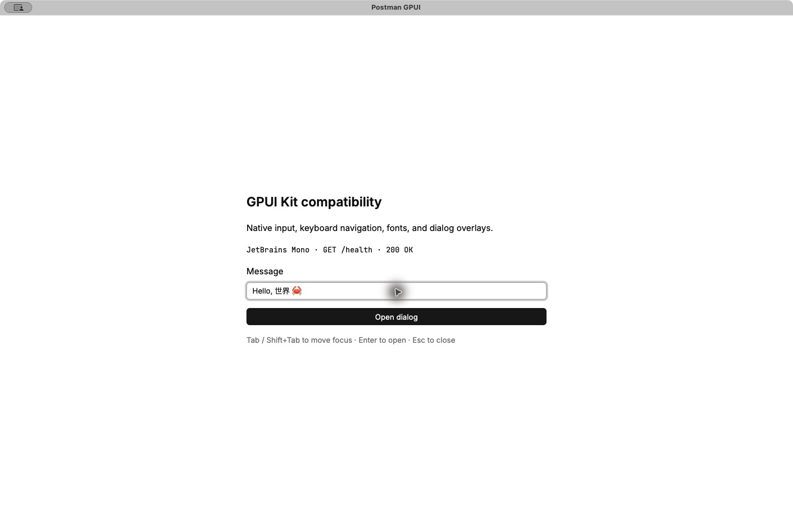
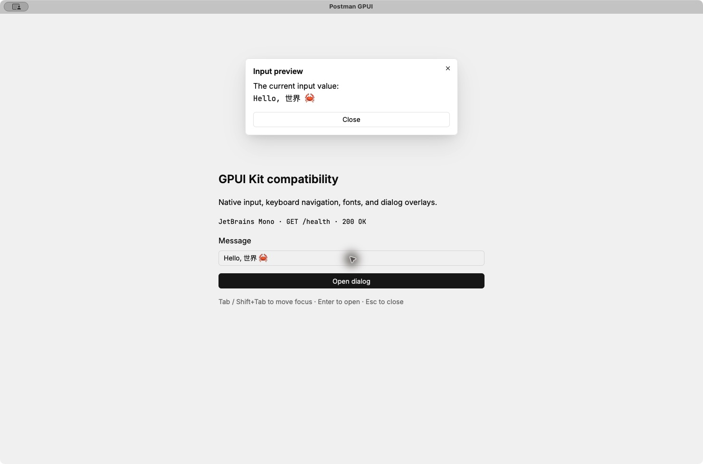

# GPUI Kit compatibility (P0)

Tracks [#195](https://github.com/847850277/postman-gpui/issues/195), the dependency
integration stage of [#194](https://github.com/847850277/postman-gpui/issues/194).
This change establishes native Kit startup and a component validation window. The
existing HTTP interface remains the default; Home/HTTP/Flows design reconstruction
and complete theme extraction belong to the following stages.

## Dependency decision

| Dependency | Pinned version / source | Purpose |
| --- | --- | --- |
| `gpui-kit` | `=0.7.1`, crates.io | Component library, base root, default icon assets |
| `gpui` (package `gpui-pre`) | `=0.3.8`, crates.io | Existing application imports and GPUI types |
| `gpui_platform` (package `gpui-pre-platform`) | `=0.3.8`, crates.io | Native platform and no-window font verifier |
| Rust toolchain | `1.97.0`, unchanged | Repository build and CI toolchain |

Kit 0.7.1's [published manifest](https://github.com/longbridge/gpui-kit/blob/v0.7.1/Cargo.toml)
requires this exact GPUI snapshot. The previous Zed Git dependency is removed from
the resolved graph. The direct `gpui` import is an alias for the same package Kit
uses, so existing custom controls and Kit controls share `App`, `Window`, `Entity`,
and test-context types. Keeping this alias avoids an unrelated import rewrite.

`Cargo.lock` records the component and snapshot dependencies. Native platform
features retain `font-kit`, `wayland`, and `x11`; Kit also enables
`runtime_shaders`. Kit's default `component` and `assets` features are enabled.
Its `test-support` feature is enabled for development/test targets only, alongside
the matching GPUI test harness. No shell, JavaScript, or WebView runtime is added.

Run `python3 scripts/check_ui_dependencies.py` to enforce the pinned, single GUI
stack and reject transitive GUI dependencies in **every other workspace crate**,
including the CLI, transport, request, Flow, and MCP crates. `cargo tree --locked -d`
still reports ordinary transitive duplicates; none is a second GPUI stack.

The API migration in existing application code consists of passing the application
context to the cookie pane's two `Window::blur` calls. The release verifier now
resolves the `gpui_platform` dependency by its Cargo alias rather than its package
name, preserving the platform-feature check after the rename.

## Startup and validation window

Normal startup registers the embedded Inter and JetBrains Mono fonts, initializes
Kit through `ui::kit::init`, sets an explicit light theme and the bundled font
families, then opens the application through `gpui_kit::open_window`. Kit's Base
`Root` hosts the existing `PostmanApp` and owns the dialog/overlay layers. The
application still owns its quit action and shortcuts.

```sh
# Existing HTTP application, now hosted in a Kit root
cargo run --locked

# Dedicated component validation window through the same executable/startup
cargo run --locked -- --kit-smoke

# Existing package verification path, with a real native text backend
cargo run --locked -- --verify-runtime-assets
```

The validation window displays both fonts, an editable Kit input, a Kit button,
and a dialog showing the input value at activation time. It does not initialize
the production history database or send requests. Try text entry, selection,
copy/paste, Tab/Shift+Tab, Enter, mouse activation, Escape, and the Close button.

The native window minimum is **960 × 640 logical pixels**, with an initial size of
1480 × 980. The old HTTP layout retains its existing internal scrolling. The
390-pixel HTML check is a prototype check, not the native desktop minimum.

## Validation evidence

Local verification on macOS / Apple silicon, October 9, 2026:

| Check | Result |
| --- | --- |
| `cargo check --locked --workspace --all-targets` | Passed |
| `cargo test --locked --workspace --all-targets --all-features` | Passed: 473 reported tests across 46 suites |
| Additional `kit_input_composes_and_commits_chinese_after_an_astral_character` unit test | Passed after the workspace run; 474 distinct tests in total |
| `cargo clippy --locked --workspace --all-targets --all-features -- -D warnings` | Passed |
| `cargo fmt -- --check` | Passed |
| `python3 scripts/check_ui_dependencies.py` | Passed |
| `python3 -m unittest discover -s scripts/tests` | Passed: 22 tests |
| Native `--verify-runtime-assets` | Passed with the macOS text backend |
| Native Kit window | Opened; both fonts and icon assets rendered |
| Native input / dialog | Chinese and Emoji paste, selection, copy/paste, Tab, Enter, Escape and return-to-input interaction verified |
| Normal native startup | Existing HTTP interface and history list opened; shortcut help opened and closed with Escape |

The workspace run includes the public HTTPBingo UI suite (13 tests, including its
scenario-file runner), request/cancel/timeout checks, layout, keyboard, clipboard,
search, and SQLite persistence regressions. Service-dependent Flow suites can
return early when their services are unavailable; their reported test counts do
**not** establish a live Vaultwarden, Meilisearch, or Qdrant run.

New compatibility tests cover the production Kit root, current-field HTTP sending
and history, input/clipboard semantics, keyboard traversal, dialog values and focus
restoration. The IME unit test drives GPUI's public input-handler protocol, checks
UTF-16 marked ranges after an Emoji, commits Chinese text, and undoes the commit.
It does **not** drive an operating-system candidate window.





Cross-platform CI for implementation commit `fe4f486` in
[PR #197](https://github.com/847850277/postman-gpui/pull/197):

| Platform | Release build and native `--verify-runtime-assets` |
| --- | --- |
| macOS | [Passed](https://github.com/847850277/postman-gpui/actions/runs/37897804298/job/113713071422) |
| Linux | [Passed](https://github.com/847850277/postman-gpui/actions/runs/37897804298/job/113713071389) |
| Windows | [Passed](https://github.com/847850277/postman-gpui/actions/runs/37897804298/job/113713071520) |

## Remaining platform acceptance

- The three platform jobs above establish release-build and native font
  compatibility; they do not establish interactive runtime acceptance.
- Windows/Linux interactive startup, clipboard, focus, and system-IME candidate
  selection need native runtime verification. The macOS system-IME candidate
  window also remains unverified; Unicode paste and the protocol test above are
  separate evidence.
- Live service-dependent Flow E2E suites remain separate from this GUI dependency
  migration and must be reported separately when run.
- Cargo reports the upstream `block 0.1.6` future-incompatibility warning; current
  builds and strict Clippy pass. Full visual parity and theme-preference persistence
  are subsequent stages, not P0 acceptance claims.
